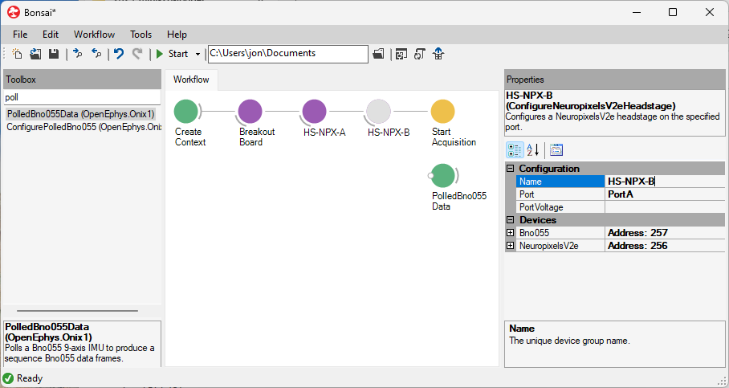
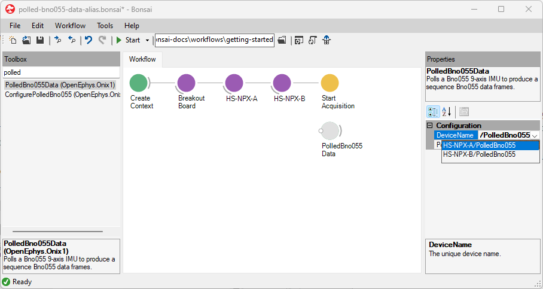

Data produced by ONIX hardware is captured using data input
operators and sent to hardware using data output operators, respectively. This
section covers their use.

## Acquire Data

Streaming data into Bonsai requires at least one [data I/O operator](xref:dataio).

### Set up data I/O operator(s)

Place a data I/O operator and set its DeviceName property for every device from which you would like
to stream. Setting the DeviceName property will tell the operator from which device to stream data.
This is referred to linking the data I/O operator to the device. Take this workflow for example:

::: workflow

:::

AnalogInput's DeviceName property is set to "BreakoutBoard/AnalogIO" so it will stream data from the
AnalogIO device on the breakout board.

## Use Multiple Instances of Identical Hardware

### Multiple headstages/miniscopes

Linking the data I/O operator to devices when using two identical headstages or
miniscopes involves an additional step: renaming a configuration operator.
Suppose you want to stream orientation data from two Neuropixels 2.0 Headstages
through using two <xref:OpenEphys.Onix1.PolledBno055Data> operators. By default,
the <xref:OpenEphys.Onix1.ConfigureNeuropixelsV2eHeadstage> operators are both
named "NeuropixelsV2eHeadstage". This causes their devices to also have
identical names, "NeuropixelsV2eHeadstage/PolledBno055". The two headstages and
their devices must be disambiguated. To do this, you must edit one or both of
headstages' `Name` property:

{width=650px}

After this, the disambiguated source can be selected for each data operator

{width=650px}

In the following workflow workflow, the `Name` property of each
<xref:OpenEphys.Onix1.ConfigureNeuropixelsV2eHeadstage> has been changed from
"NeuropixelsV2eHeadstage" to "HS-NPX-AB" and "HS-NPX-B". The `DeviceName` of
each of the <xref:OpenEphys.Onix1.PolledBno055Data> operators has been set to
"HS-NPX-A/PolledBno055" and "HS-NPX-B/PolledBno055" from the dropdown so each
operator will take data from a different headstage.

::: workflow

:::

### Multiple ONIX systems

If a second ONIX system is used on the same computer, a second configuration
chain operator is required. In this case, the `Index` property of the
configuration chain that corresponds to the second system should be set to 1. If
three systems are used, they would have `Index` values of 0, 1, and 2. etc.

::: workflow

:::

Now that you can stream data into Bonsai from ONIX hardware, the next step is
visualize the data.