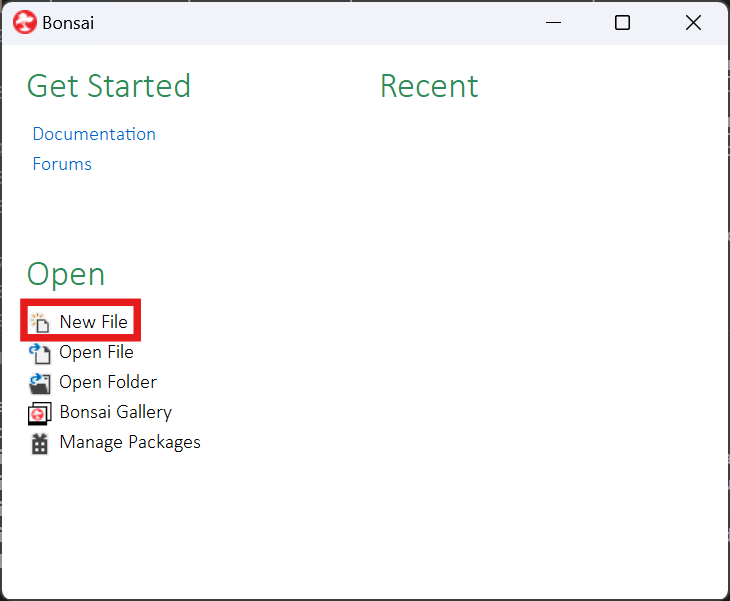
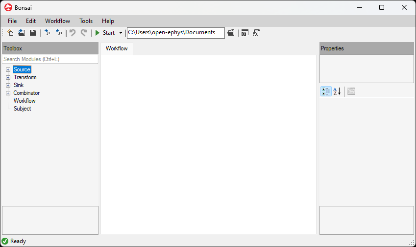
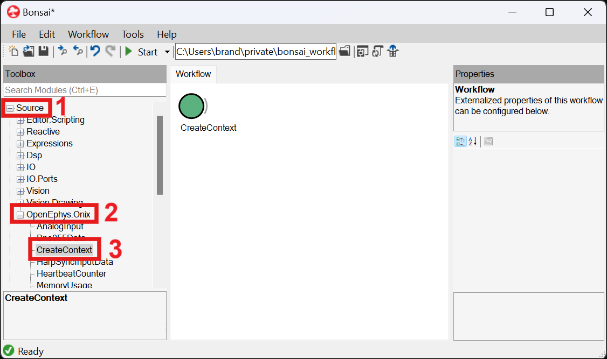
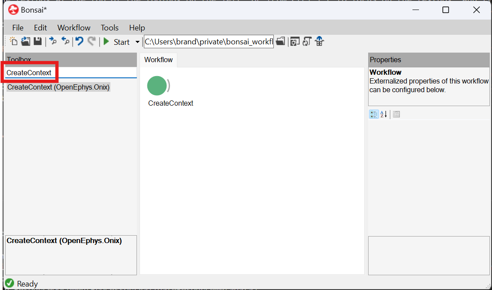
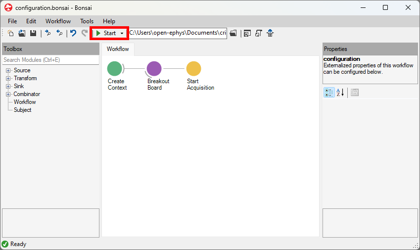

Scripts in Bonsai are known as workflows. A workflow comprises of "operators" that are represented
by nodes which connect to form a data processing graph. Each connection indicates that the
downstream operator on the right takes the sequence of data from the upstream operator on the left
as input. The behavior of an operator depends on its type. For example:

- A `source` operator produces its own sequence of data.
- A `transform` operator transforms data in its input sequence.
- A `sink` operator produces a side effect (such as writing data or outputting an external signal
like a noise through your computer's speaker or a digital output toggle through your Onix breakout
board).
- A `combinator` operator controls the flow of downstream sequences.

The workflow editor represents these operators using different colors and a grey arc. The [official
Bonsai docs](https://bonsai-rx.org/docs/articles/operators.html) provides a nice description of operators 
and the various types with pictures.

Below is an example workflow which configures ONIX hardware. 

::: workflow

:::

We'll take a closer look at how it works in the following page.

## Open the Workflow Editor

The workflow editor in Bonsai can be opened by opening a workflow or .bonsai file in Bonsai. You can
do this by starting Bonsai and clicking on the **New File** button, for example. If you have
previously opened or saved a file in Bonsai, there will be a list of recently opened files on the
right side; any of those can be chosen and they will be opened in the editor automatically. 

{width=650px}

This is how the workflow editor look. There are currently no operators in the workflow.

From here, operators can be selected on the left-side and placed into the workspace.

## Access Help Browser

Even before placing a node, the first thing you should know after opening the workflow editor is how
to access the Help browser. You can hover over the Help button in the top utility ribbon at the top
of the Bonsai UI and click **View Help** or press <kbd>F1</kbd>. The contents that appear in the
help browser depends on what is selected in the workflow editor when the help browser is opened. For
example, without selecting anything, <kbd>F1</kbd> invokes the [official Bonsai docs Workflow Editor 
page](https://bonsai-rx.org/docs/articles/editor.html). If a node in the workflow or a module in the
Toolbox is selected, <kbd>F1</kbd> invokes documentation about that operator which can also be
navigated to [here](xref:OpenEphys.Onix1).

## Place a Node onto the Workflow

There are several different ways to finding an operator and adding it to the workflow. Because the
[CreateContext](xref:OpenEphys.Onix1.CreateContext) operator is required for every workflow that
interfaces with Onix hardware (as we'll learn in the next section), let's use it as an example: 

1. From the Bonsai editor, navigate to the toolbox on the left side of the screen and expand the
   **Source** section. Next, expand the **OpenEphys.Onix1** section, and find the `CreateContext`
   line. The operator can then be added by either double-clicking it, or dragging and dropping the
   operator into the workflow.

    {width=700px}

2. Click on the textbox at the top of the toolbox on the left, or from Ctrl + E to focus on the
   textbox, and type `CreateContext` to search for the operator. Same as (1), the operator can be
   placed by double-clicking or dragging and dropping; additionally, if the `CreateContext` string
   is highlighted Enter can be pressed to place the operator immediately.

    {width=700px}

3. Hover over the image of the [CreateContext workflow](xref:OpenEphys.Onix1.CreateContext), and
   click on the clipboard icon in the top-right corner of the workflow image to copy the workflow to
   the clipboard. Navigate back to Bonsai, and paste the copied workflow into the active editor.
   Pasting can be done via <kbd>Ctrl + V</kbd>, or right-clicking in the editor and choosing **Paste**.

## Manipulate Node Connections

The table below provides information on how to add connections between operators, remove
connections, reordering operators horizontally and vertically, as well as some shortcuts to aid in
placing operators more efficiently.

| Goal | Clicks / Keystrokes | Description |
| ---- | ------------------- | ----------- |
| Connect two operators | Click and hold the first operator, drag the cursor to the second operator, and release | While dragging the cursor, it will temporarily change to a red symbol until there is a valid target (e.g., the second operator), where it will change to an up arrow |
| Connect two operators | Right-click the first operator, and select **Create Connection**. Select the second operator | While moving the cursor, it will change to an up arrow. A valid operator target will change color when hovering over it |
| Connect two operators on placement | Click on an operator in the editor to select it, then place an operator using either method (1) or (2) above | If an operator is currently selected in the editor when a new operator is added, whether it is added by clicking and dragging, double-clicking, or pressing **Enter**, the newly placed operator will be connected to the first operator automatically |
| Disconnect two operators | Click the first operator to select it, hold **Shift**, click and hold the first operator, drag to the second operator, and release | While dragging the cursor, it will temporarily change to a red symbol until there is a valid target (e.g., the second operator), where it will change to an up arrow |
| Disconnect two operators | Right-click the first operator, and select **Remove Connection**. Select the second operator | While moving the cursor, it will change to an up arrow. A valid operator target will change color when hovering over it |
| Move row of operators up | Hold **Alt**, click and hold the first operator, drag upwards to an operator in another row, and release | This action does not require that the operator be selected prior to performing the action. The second operator that is highlighted when the button / mouse are released will now be under the first operator |
| Change order of operators in a row | Hold **Ctrl**, click and hold the first operator, drag to the right to the second operator, and release | This action does not require that the operator be selected prior to performing the action. This can change the order of any two operators that are a part of the same row; it is not constrained to adjacent operators. Note that if the new placement of the operators is not valid (such as giving a `Source` operator an input), it will knock the operator of the current row and remove any connections |

Aside from determining the order of execution, the order of operators within a workflow determines
which editing actions can be taken. In the table below, the "first" operator is always the one that
is on the left side, or on the bottom for multiple rows of operators. If the first operator clicked
is on the right side, or on the top, these actions will not work.

> [!TIP] 
> The official Bonsai Documentation contains [a list of commands and
> shortcuts](https://bonsai-rx.org/docs/articles/editor.html#commands-and-shortcuts).

Information from this and the previous can be applied to start writing workflows. Create a hardware configuration chain. 

## Access GUIs

Some operators, specifically many of the `Configure*` operators, can have a GUI attached to the
operator that allows for easy manipulation of **Configuration** properties in a graphical
environment. These GUIs can be accessed by double-clicking on an operator; if there is a GUI
assigned to it, then it will be opened up in a new window. Please note that not all operators have
GUIs, but if you think that an operator would benefit from having this functionality added please
reach out to us.

> [!Note]
> GUIs are not part of the base `OpenEphys.Onix1` library. To take advantage of this added
> functionality, you must install the accompanying `OpenEphys.Onix1.Design` library using the Bonsai
> package manager.

A number of Bonsai operators also come with GUIs, but similar to `OpenEphys.Onix1`, the
corresponding `*.Design` library must be installed before it can be leveraged.

## Start the Workflow

Once all operators have been placed and linked correctly, and all **Configuration** properties have
been set, it is now possible to run a workflow. Note that some aspects of Bonsai are only available
in specific contexts; for instance, the GUIs mentioned above can only be opened when a workflow is
not running. Once a workflow is running, these GUIs are not accessible, but visualizers for certain
operators can be opened to view the streaming data.

Running a workflow can be done in one of two ways: (1) Press the **Start** button at the top of the
Bonsai editor, and (2) Press F5. Upon starting a workflow, a context will be created, and all
devices will be configured based on the **Configuration** properties. Any `*Data` operators will
then begin streaming data, and can be visualized. 

## Next Step

Now that you know the basics of how to make a workflow and navigating the workflow editor, the next
step is to learn how to construct a workflow that is meant to interface with Onix hardware.