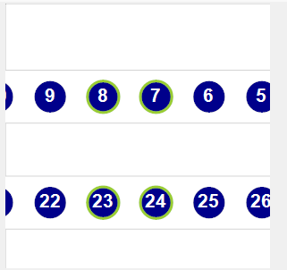
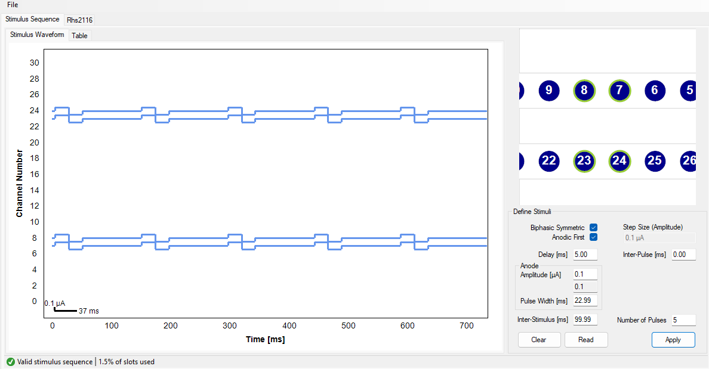
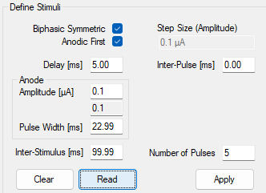

The `Rhs2116` headstage has a graphical user interface when the `OpenEphys.Onix1.Design` package is
downloaded. For more information on how to install that library, check out the
<xref:install-configure-bonsai> page.

## Overview

The GUI for `Rhs2116Headstage` allows for an easy way to change settings, as well as the ability to
set waveform parameters and visualize the effect. From the GUI, you can:

- Modify stimulus parameters for all 32 channels
  - Visualize waveforms across all channels
  - Select specific channels using a ProbeInterface representation of the hardware
  - Remove or add stimulus waveform parameters to one or more channels at a time
  - Save and load channel configuration
- Change filter settings for recording data
  - See <xref:OpenEphys.Onix1.ConfigureHeadstageRhs2116> or the 
  [Rhs2116 datasheet](https://intantech.com/files/Intan_RHS2116_datasheet.pdf) for more
  information on filter settings

This configuration GUI can be accessed by double-clicking on the `ConfigureHeadstageRhs2116`
operator. 

  

### Stimulus parameters

The GUI accepts values for stimulation waveform parameters in metric units (e.g., milliseconds and
microamps). In the backend, the GUI converts metric units into units that can be written to the
hardware. Because the conversion between metric values and converted values is not always exact, the
GUI might automatically update the metric value initially input by the user to a metric value that
more accurately represents the converted value that will be written to hardware. This update is
visually displayed in the same text box where the user initially input their values and happens when
the focus moves away from the active text box (e.g., the user presses <kbd>Tab</kbd> or clicks
somewhere outside of the text box).

Below is a table describing the various stimulus parameters that can be applied to each channel
including the resolution and limits for each parameter.

| Parameter Name | Minimum Value | Maximum Value | Resolution | Remarks |
| ----- | ---- | ---- | ---- | ---- |
| `Biphasic Symmetric` | Unchecked | Checked | n/a | If checked, the positive and negative segments of each pulse will be symmetric |
| `Anodic First` | Unchecked | Checked | n/a | If checked, the anodic (positive) segment will be delivered first for every pulse |
| `Delay` | 0 ms | n/a | 0.03312 ms | Time between a trigger being received and the first pulse is delivered |
| `Inter-Pulse` | 0 ms | n/a | 0.03312 ms | Time between positive-to-negative (or negative-to-positive) stimulation for a single pulse |
| `Amplitude` | 0 µA | 2550 µA | Dependent on the step size | Enter the requested amplitude, and the actual value that will be applied on hardware based on the current step size is displayed underneath in the `Step Size` text box |
| `Step Size` | 0.01 µA | 25 µA | [Step Size](xref:OpenEphys.Onix1.Rhs2116StepSize) | Automatically calculated to optimize difference between requested and actually possible amplitude |
| `Pulse Width` | 0.03312 ms | n/a | 0.03312 ms | Time between each pulse's rising edge and falling edge (or vice-versa) |
| `Inter-Stimulus` | 0.03312 ms | n/a | 0.03312 ms | Time between successive pulses. Can be 0 if there is only one pulse |
| `Number of Pulses` | 1 | n/a | 1 | Number of pulses that are sent per trigger received |

### ProbeInterface

The `Rhs2116Headstage` GUI uses the
[ProbeInterface](https://probeinterface.readthedocs.io/en/main/index.html) format to draw the probes
and electrodes visually. For more information on the ProbeInterface JSON format, check out their
[format specifications](https://probeinterface.readthedocs.io/en/main/format_spec.html) page. 

When opening the GUI, there is a default probe configuration that is loaded and drawn which can be
saved to a [JSON file](#save-probeinterface-file). Conversely, an existing ProbeInterface JSON file
can be [loaded](#load-probeinterface-file) to update the current channel configuration. If the
default configuration is needed, it can be [loaded again](#load-default-configuration) at any time.

## Using the Channel Selection Window

Upon first opening the GUI, the main window will be blank if no stimulus parameters have been
defined. The window should look something like this:

  

### Selecting channels

Once a GUI has been [opened](#overview), the panel in the top right will be populated with a default
`Rhs2116` probe group, which is a graphical representation of the channels based on their location
on the PCB. The probe group is oriented where the tether is located above the channels shown. Below
are the controls used to navigate within this panel to view and choose electrodes.

- Mouse Controls
    - Mouse wheel zooms in/out towards the cursor
    - Left-click and drag will select electrodes within the drawn rectangle
    - Left-click on an electrode will toggle selection for that electrode
    - Left-click on empty space will clear the electrode selection
    - Middle-click and drag will pan the electrodes

When channels are selected, they will be highlighted by a green circle around the contact number,
and the corresponding waveforms will be plotted in the main window; any channels that are
not selected will not be plotted.

### Zoom and pan limits

When zooming in and out, there are limits in both directions. The probe can only be zoomed out to
the point that the entire probe is visible within the panel and no more. Similarly, while zooming in
the probe will not zoom in past a certain point. 

In addition to the absolute zoom limits, the panel will automatically shift the probe to ensure it
is always in view. This is handled each time the probe is zoomed or panned.

## Define Stimuli

The following sections define how to apply parameters, read existing parameters, and clear parameters from channels.
They also provide example stimulus parameters and descriptions of error codes that can appear in the status strip to
facilitate troubleshooting.

### Applying parameters

The first step is to [select the channel(s)](#selecting-channels) where the parameters will be applied.
Note that the same set of parameters can be simultaneously applied to any or all channels without
restriction. If any channel already has stimulation parameters, note that selecting channels will
only plot the selected channels in the main window. In the example below, channels 7, 8, 23, and 24
are selected.

  

Enter the [stimulus parameters](#stimulus-parameters) that you want to apply to the currently
selected channel(s). Note that the value initially input by the user might update when the focus
moves away from the current text box (e.g., the user presses <kbd>Tab</kbd> or clicks somewhere
outside of the text box) to reflect the actual value that will be written based on the resolutions
listed above. In the example below, we can see that the table listed below as well shows the typed
values compared to the actual values list.

| Parameter | Requested Value | Listed Value |
| --- | --- | --- |
| `Delay [ms]` | 5 | 5.00 |
| `Inter-Pulse [ms]` | 0 | 0.00 |
| `Anodic Amplitude [µA]` | 0.1 | 0.1 |
| `Anodic Pulse Width [ms]` | 23 | 22.99 |
| `Inter-Stimulus [ms]` | 100 | 99.99 |

  

> [!TIP]
> If a channel already has stimulus parameters applied to it, it is easy to change individual
> parameters by only writing in the applicable text box. Any boxes without input will not be
> applied.

The selected settings can be applied to the selected channels by pressing <kbd>Apply</kbd>, and the
waveforms will be plotted in the main window as shown below.

  

To see the values that will be written to the hardware, click on the `Table` tab in the top left,
next to the `Stimulus Waveform` tab. This will open up a table that displays all 32 channels, and
the value in steps and samples that could be written to the hardware. Any changes made to the
channels parameters will be reflected in this window. An example of what the empty table looks like
when no parameters have been set is below.

  

### Reading current parameters

To easily copy settings from one channel to another, or to see what the current settings are on a
channel prior to updating then settings, click on a single channel in the channel selection window,
or click-and-drag until a single channel is selected, and then press on the <kbd>Read</kbd> button
in the bottom right. If more than one channel is selected, or no channels are selected, a window
will pop up prompting the user to select a single channel.

To test this, select a channel that has not been configured yet and press <kbd>Read</kbd>. The
parameter fields will be populated with zeroes as shown in the image below:

  

Now select a channel that has been configured and press <kbd>Read</kbd> to read that channel's
current parameters. For example, if one of the channels that was configured in the [Applying
parameters](#applying-parameters) section above is selected, the image below shows the result of the
operation:

  

### Clearing current parameters

To quickly remove the current stimulus parameter configuration from any given channel(s), select as
many channels as are needed and then press the <kbd>Clear</kbd> button. This will reset the
channel(s) to their default configuration, which removes all parameters. The waveforms will be
updated to show that there are no pulses being delivered on the channel(s).

## Status strip

The bottom left corner of the window shows the current status of the configuration settings. Below
is a table showing the possible statuses, as well as additional information on what each message
means and how invalid settings can be modified to allow the settings to be saved. In addition to the
status message, there is an additional message in the status strip that keeps a tally of how complex
the waveforms are. This is displayed as a total percentage of the number of slots used (or will be
used) by the hardware. Increasing the number of pulses will use more slots, and introducing pulses
across different channels that occur at different rates will use more slots.

| Image | Status Label | Remarks |
| ---- | ---- | ---- |
|  | `Valid Stimulus Sequence` | There are no issues with the current configuration, and the number of slots fits within the hardware boundaries. Settings can be saved. |
|  | `Invalid Sequence - Too many pulses defined` | The resulting waveform is too complex (for example, using the same settings as above but setting 350 pulses will give this error.). Reduce the complexity of the waveform before saving the configuration. |
|  | `Invalid Sequence - Contact XX, Reason: Y` | Some combination of stimulus parameter settings is invalid and must be fixed before changes can be saved. The first contact with an invalid parameter set will be listed here, along with the actual reason. [Below](#reasons-for-invalid-sequence-status) is a list of possible reasons, but this is not an exhaustive list. |

> [!TIP]
> In the case that there is an error defined on a particular channel, but it is unclear why the error
exists since it appears that nothing is configured on that channel, try selecting the channel and
[clear the configuration settings](#clearing-current-parameters)

### Reasons for invalid sequence status

| Reason | Explanation |
| --- | --- |
| `Stimuli = 0, Cathodic Width > 0` | The cathodic pulse width is greater than zero, but the number of pulses defined on the contact is zero. |
| `Stimuli = 0, Anodic Width > 0` | The anodic pulse width is greater than zero, but the number of pulses defined on the contact is zero. |
| `Stimuli = 0, ISI > 0` | The inter-stimulus interval is greater than zero, but the number of pulses defined on the contact is zero. |
| `Stimuli = 0, Anodic Steps > 0` | The number of anodic amplitude steps is greater than zero, but the number of pulses defined on the contact is zero. |
| `Stimuli = 0, Cathodic Steps > 0` | The number of cathodic amplitude steps is greater than zero, but the number of pulses defined on the contact is zero. |
| `Stimuli = 0, Delay > 0` | The delay is greater than zero, but the number of pulses defined on the contact is zero. |
| `Stimuli = 0, Dwell (Inter-Pulse) > 0` | The inter-pulse interval is greater than zero, but the number of pulses defined on the contact is zero. |
| `Anodic Width = 0, Anodic Steps > 0` | The anodic amplitude is greater than zero, but the anodic pulse-width is set to zero on this contact. |
| `Cathodic Width = 0, Cathodic Steps > 0` | The cathodic amplitude is greater than zero, but the cathodic pulse-width is set to zero on this contact. |
| `ISI = 0, Stimuli > 1` | The inter-stimulus interval is equal to zero, but the number of stimuli is greater than one. |

## Keeping or discarding settings

While the GUI is open, any changes to the configuration settings can be freely modified and will not
affect the configuration unless <kbd>Ok</kbd> is pressed. This includes all aspects of the
configuration, such as filter settings and all stimulus waveform parameters.

> [!NOTE] 
> The hardware is not actually configured until the workflow starts.

If the window is closed any other way (such as by pressing `Cancel` or pressing the <kbd>X</kbd> to
close the window), any changes made *will not* be saved. If the current settings are considered
invalid (see [the table above](#reasons-for-invalid-sequence-status) for specific reasons why some
settings are invalid), they also *will not* be saved even if <kbd>Ok</kbd> is pressed. A message box
will pop up warning that the settings will not be saved, giving the opportunity to continue editing
and correct any settings that need modification.

## Save ProbeInterface file

To save a [ProbeInterface](#probeinterface) JSON file fully describing the probe, including which
electrodes are currently enabled, go to the File drop-down menu, and select `Channel Configuration →
Save Channel Configuration`. This will open a file dialog window to save the new JSON file. Choose a
folder location and a name for the file, then hit `Save`. This will export the current channel
configuration. This is a useful way to save any manually enabled electrodes as a backup, or to
easily switch between different configurations between recordings.

## Load ProbeInterface file

To load a [ProbeInterface](#probeinterface) JSON file, navigate to the File drop-down menu and
select `Channel Configuration → Load Channel Configuration`. This will open a file dialog window;
browse to the existing JSON file, select it and press `Open` to load the channel configuration. The
new probe shape will be loaded and drawn, with the enabled electrodes highlighted as usual.

> [!NOTE] 
> When loading a new configuration, the total number of electrodes must match the existing
> configuration, and the number of enabled electrodes must match.

## Load default configuration

To load the default channel configuration at any time, navigate to the File drop-down menu and
choose `Channel Configuration → Load Default Channel Configuration`. This will load the default
configuration, with the default orientation as described above.
