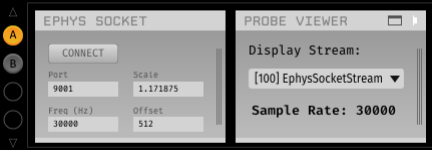
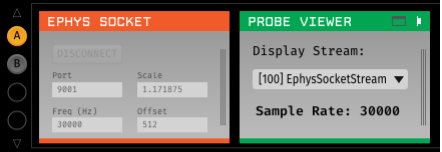
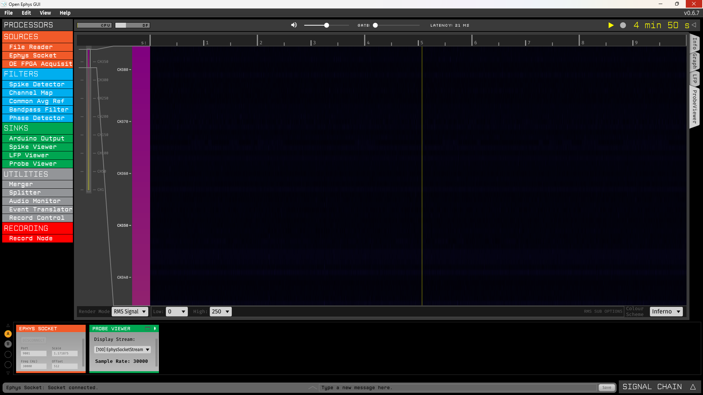
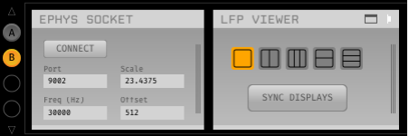
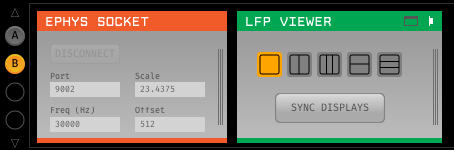
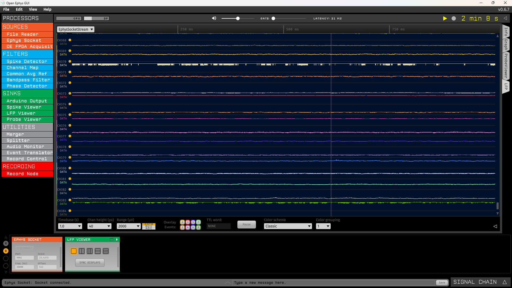

This tutorial shows how to establish a TCP connection to visualize data acquired with ONIX hardware in the Open Ephys GUI, using the OpenEphys.Sockets.Bonsai and OpenEphys.Onix1 Bonsai packages, and the Ephys Socket Open Ephys GUI plugin.

In this example, we transmit two data streams from a NeuropixelsV1e probe: the LFP band and the AP band data (384 channels). This approach lets users take advantage of the specialized visualizers available in the Open Ephys GUI, such as the Probe Viewer which was specifically designed for very dense arrays like Neuropixels probes.

Even though the Open Ephys GUI has recording functionality, when acquiring data using the Bonsai ONIX package, data should be written to file in Bonsai following the [Hardware Guides](xref:hardware). In particular, for the NeuropixelsV1e data presented in this example, follow the [NeuropixelsV1e Headstage Hardware Guide](xref:np1e).

This tutorial guides you through building the following workflow: 

::: workflow

:::

<!-- This method is generalizable to any continuous data stream in the correct matrix format -->

> [!NOTE]
> Although this tutorial uses NeuropixelsV1e Headstage as an example, the process is similar for other ephys headstages. This
> tutorial assumes you are familiar with the [hardware guide](xref:hardware) of the ONIX headstage you intend to use.
> Use this [reference](xref:reference) for which ephys <xref:dataio> and scaling you need to use for each headstage, and links to relevant
> documentation. 

## Get Started in Bonsai and the Open Ephys GUI

Follow the [Getting Started](xref:getting-started) guide to set up and get familiarized with Bonsai. In particular:

- [Download the necessary Bonsai packages](xref:install-configure-bonsai#install-packages-in-bonsai) or 
[check for updates](xref:install-configure-bonsai#update-packages-in-bonsai) if they're already installed. This tutorial assumes you're using the latest packages.
- Read about [visualizing data](xref:visualize-data). We recommend verifying each step of the tutorial by visualizing the data produced.

<!-- Make sure they install OpenEphys.Sockets.Bonsai, or is this going to be included in the "necessary Bonsai packages"? -->

<!-- Open Ephys GUI instructions -->

## Configure the TCP Connection in Bonsai

::: workflow

:::

<!-- add txt -->
<!-- Tip about Use Alt and drag if not at the top -->

## Configure the Hardware

Construct a [top-level hardware configuration chain](xref:initialize-onicontext): 

::: workflow

:::

1. Place the [configuration operators](xref:configure) that correspond to the hardware you intend to use between
<xref:OpenEphys.Onix1.CreateContext> and <xref:OpenEphys.Onix1.StartAcquisition>. In this example, these are <xref:OpenEphys.Onix1.ConfigureNeuropixelsV1eHeadstage> and <xref:OpenEphys.Onix1.ConfigureBreakoutBoard>.
1. Confirm that the device that streams electrophysiology data is enabled. In this example, we will be using the device NeuropixelsV1eData.
1. Configure the hardware as necessary. In the case of NeuropixelsV1e Headstage, you must provide gain and calibration files and can perform other configurations as explained in the [NeuropixelsV1e Headstage Configuration](xref:np1e_configuration).

## Stream Ephys Data into Bonsai

Place the relevant operators to stream electrophysiology data from your headstage:

::: workflow

:::

1. Place the <xref:OpenEphys.Onix1.NeuropixelsV1eData> node into the workflow, since the device on NeuropixelsV1e Headstage that streams electrophysiology data is the Neuropixels 1.0 probe.
1. Select the relevant members from the data frames that `NeuropixelsV1eData` produces. In this example, the relevant members are "SpikeData" and "LfpData". To do this, right-click `NeuropixelsV1eData`, hover over the output option in the context menu, and select "SpikeData" from the list. Repeat for "LfpData".

Visualize the raw data to confirm that the ephys data operator is streaming data. 

## Configure the Data Streams to Transmit

Connect a `SendMatOverSocket` operator to each of the electrophysiology data streams. This operator comes from the OpenEphys.Sockets Bonsai package. Make sure it's [installed and updated](xref:install-configure-bonsai).

<!-- I'm not sure how to link to the reference as was done with other nodes <xref:Bonsai.Dsp.SelectChannels> -->

::: workflow

:::

Configure the "Connection" property of each `SendMatOverSocket` node to each of the TCP Socket names configured earlier. In this example, we used "socket1" for "SpikeData" and "socket2" for "LfPData".

## Configure the TCP Socket in the Open Ephys GUI to Stream and View Data
### Stream SpikeData using the Open Ephys GUI Ephys Socket processor

{width=650px}

{width=650px}

### View SpikeData using the Open Ephys GUI Probe Viewer processor

{width=650px}

### Stream LfpData using the Open Ephys GUI Ephys Socket processor

{width=650px}

{width=650px}

### View SpikeData using the Open Ephys GUI LFP Viewer processor

{width=650px}

## Stream Ephys Data in Bonsai and Visualize it in the Open Ephys GUI

<!-- add video -->
<!-- add troubleshooting -->