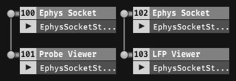
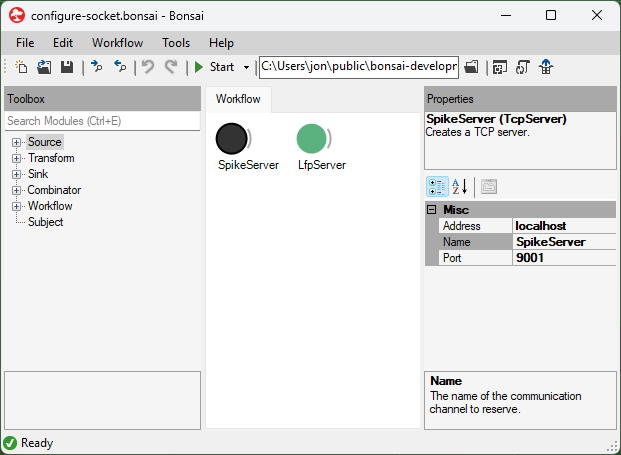
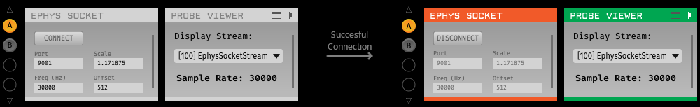
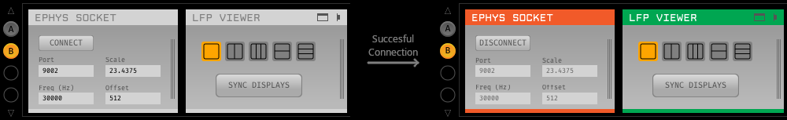

This tutorial shows how to stream ephys data from Bonsai the Open Ephys
GUIthrough an intermediary TCP connection. This approach lets users take
advantage of both the extensibility of Bonsai and specialized visualizers
available in the Open Ephys GUI such as the Probe Viewer which is specifically
designed for very dense arrays like Neuropixels probes. By the end of this
tutorial, you will have a workflow that transmits two data streams from a
NeuropixelsV1e headstage (384 channels of LFP band and AP band data) and an Open
Ephys GUI signal chain that receives and visualizes the two data streams in the
Open Ephys GUI:

Click <a href="../../workflows/tutorials/ephys-socket/sockets-signal-chain" download>here</a> to
download the signal chain that corresponds to the above graph.

> [!NOTE]
> This tutorial uses NeuropixelsV1e Headstage as an example, but the process is
> similar for other ephys headstages. In fact, this tutorial can be used to send
> data from any Bonsai operator that produces an applies to any data source that
> produces matrices (`OpenCV.NET.Mat`s).
>
> This tutorial assumes you are familiar with the [hardware
> guide](xref:hardware) of the ONIX headstage you intend to use. Use the
> information on the <xref:data-elements> reference page to know which shift and
> scaling you need to use for each device on other headstages.
>
> A [video summary](#video-summary) of this tutorial is is available at the
> bottom of this page.

## Transmit Ephys Data to a TCP Server in Bonsai

Follow the [Getting Started](xref:getting-started) guide to set up and
familiarize yourself with Bonsai. In particular, [download the necessary Bonsai
packages](xref:install-configure-bonsai#package-installation) or [check for
updates](xref:install-configure-bonsai#update-packages) if they're already
installed. Once you've done that, copy/paste the following workflow into your
Bonsai editor. The following sections explain how to configure each element of
this workflow

::: workflow

:::

### Configure TCP Connection

Place one ``TcpServer`` node per datastream at the top of the workflow and
set their properties:

- **Address**: Use "localhost" if you are running Bonsai and the Open Ephys GUI
  on the same machine or the IP address of the machine running the GUI if not.
- **Name**: give the TCP server a unique name. We will use this name to provide
  later in the workflow to send data though the connections established by this
  server. In this example, we have named them "SpikeServer" and "LfpServer".
  These names are arbitrary, but in our example they correspond to the kind of
  data they will transmit.
- **Port**: choose a unique [port
  number](https://en.wikipedia.org/wiki/List_of_TCP_and_UDP_port_numbers). We
  will use this port number to establish the connection with the Open Ephys GUI.
  This mut be unique for each datastream that you wish to send. We used 9001 for
  our spike data and 9002 for LFP data.

> [!IMPORTANT]
> The TcpServer nodes need to be at the top of the workflow. If they end up
> somewhere else and you need to move them, do the following: click and hold on
> the node, hold down the Alt key on the keyboard, hover over a node in the
> workflow row over which you want to place it until an arrow appears, and let
> go. To learn more about moving nodes and connections in the workflow, refer to
> our [Workflow Editor](xref:workflow-editor) page.

### Configure ONIX Hardware

Construct an ONIX [hardware configuration chain](xref:onix-configuration):

::: workflow

:::

1.  Place the [configuration operators](xref:configure) that correspond to the
    hardware you intend to use between <xref:OpenEphys.Onix1.CreateContext> and
    <xref:OpenEphys.Onix1.StartAcquisition>. In this example, these are
    <xref:OpenEphys.Onix1.ConfigureNeuropixelsV1eHeadstage> and
    <xref:OpenEphys.Onix1.ConfigureBreakoutBoard>.
1.  Confirm that the device that streams electrophysiology data is enabled. In
    this example, we will stream data from the NeuropixelsV1e device which can
    be found in the properties panel by clicking the NeuropixelsV1eHeadstage
    node.
1.  In the case of NeuropixelsV1e Headstage, you must provide gain and
    calibration files and can perform other configurations as explained in the
    [NeuropixelsV1e Headstage Configuration](xref:np1e_configuration) and
    [NeuropixelsV1e GUI](xref:np1e_configuration) pages. In this example, we
    used an AP Gain value of 1000 and LFP Gain value of 50.

### Stream Ephys Data

Place the relevant [data I/O operators](xref:dataio) to stream electrophysiology
data from your headstage:

::: workflow

:::

1. Place the <xref:OpenEphys.Onix1.NeuropixelsV1eData> node into the workflow,
   since the device on NeuropixelsV1e Headstage that streams electrophysiology
   data is the Neuropixels 1.0 probe.
1. Select the relevant members from the data frames that `NeuropixelsV1eData`
   produces. In this example, the relevant members are "SpikeData" and
   "LfpData". To do this, right-click `NeuropixelsV1eData`, hover over the
   output option in the context menu, and select "SpikeData" from the list.
   Repeat for "LfpData".

Visualize the raw data to confirm that the ephys data operator is streaming
data.

### Transmit Data to Socket

Connect a `SendMatOverSocket` operator to each of the electrophysiology data
streams. This operator comes from the OpenEphys.Sockets Bonsai package.

::: workflow

:::

Configure the "Connection" property of each `SendMatOverSocket` operator to each
of the TCP Socket names configured earlier. In this example, we used
"SpikeServer" for "SpikeData" and "LfpServer" for "LfPData".

> [!TIP]
> Although the Open Ephys GUI has recording functionality, data acquired using
> the Bonsai.Onix1 package should be written to disk in Bonsai because it is
> possible for data to be lost if e.g. the TCP Buffer overflows. You can learn
> to do this by following the [Hardware Guides](xref:hardware) for your
> particular hardware. For this example, if you are using the NeuropixelsV1e
> Headstage like the example, follow the [NeuropixelsV1e Headstage Hardware
> Guide](xref:np1e).

## Receive ONIX Data from Socket in Open Ephys GUI

Follow the [Open Ephys GUI documentation](https://open-ephys.github.io/gui-docs/) to set up and
get familiarized with the Open Ephys GUI. In particular:

- Download and install the application by following the [Open Ephys GUI installation
  instructions](https://open-ephys.github.io/gui-docs/User-Manual/Installing-the-GUI.html)
- Install the Ephys Socket plugin and the Probe Viewer plugin by using the [Plugin
  Installer](https://open-ephys.github.io/gui-docs/User-Manual/Plugins/index.html#plugin-installer).
- Read about [Exploring the user
  interface](https://open-ephys.github.io/gui-docs/User-Manual/Exploring-the-user-interface.html),
  [Building a signal
  chain](https://open-ephys.github.io/gui-docs/User-Manual/Building-a-signal-chain.html) and
  [General plugin
  features](https://open-ephys.github.io/gui-docs/User-Manual/Plugins/index.html#general-plugin-features)

### Configure processors to visualize spike data

Drag the source processor `Ephys Socket` from the Processor list and drop it
onto the Signal Chain area, followed by the sink processor `Probe Viewer`.

Ephys data in the Open Ephys GUI is represented using floating point values in units
of microvolts. Data coming from Bonsai will need to be converted to microvolts in
order to plot properly within the GUI. To do this, the  `Ephys Socket` processor
provides the "Scale" and "Offset" values.:

 $Output\, (uV)= Scale * (Input - Offset)$

In this tutorial we used the following values:

- **Scale**: 1.171875.The NeuropixelsV1e device on NeuropixelsV1e
  headstage has a step size of 1.2e6/1024/_gain_&nbsp;μV/bit and the AP Gain was
  configured at 1000.
- **Offset**: 512. The NeuropixelsV1e device outputs offset-binary
  encoded signed 10-bit data, so 512 corresponds to 0 volts.

After configuring `Ephys Socket` processor, press the "Connect" button to
establish a connection with the `LfpServer` running in Bonsai.

Open the visualizer by clicking the “tab” button in the upper right of the `Probe Viewer`. Click the
play button in the Control Panel at the top of the GUI to begin data acquisition.

### Configure processors to visualize LFP data

Drag the source processor `Ephys Socket` from the Processor list and drop it
onto the Signal Chain area, followed by the sink processor `LFP Viewer`.
configure the `Ephys Socket` processor "Scale" and "Offset" to convert incoming
data to microvolts. In this tutorial we have used the following values for
these parameters:

- **Scale**: 23.4375. The NeuropixelsV1e device on NeuropixelsV1e
  headstage has a least significant bit of 1.2e6/1024/_gain_&nbsp;μV/bit and the
  LFP Gain was configured at 50.
- **Offset**: 512. The NeuropixelsV1e device outputs offset-binary
  encoded signed 10-bit data, so 512 corresponds to 0 volts.

After configuring `Ephys Socket` processor, press the "Connect" button to
establish a connection with the `LfpServer` running in Bonsai.

Open the visualizer by clicking the “tab” button in the upper right of the `LFP
Viewer`. Click the play button in the Control Panel at the top of the GUI to
begin data acquisition.

> [!TIP]
> You can read more about using each specific plugins used in this tutorial by reading their documentation:
> - [Ephys Socket plugin](https://open-ephys.github.io/gui-docs/User-Manual/Plugins/Ephys-Socket.html)
> - [Probe Viewer plugin](https://open-ephys.github.io/gui-docs/User-Manual/Plugins/Probe-Viewer.html)
> - [LFP Viewer plugin](https://open-ephys.github.io/gui-docs/User-Manual/Plugins/LFP-Viewer.html)

## Video Summary

Below is video summary of this tutorial showing how this works:

<video controls style="width:100%">
  <source src="../../images/ephys-socket-tut/ephys_socket.mp4" type="video/mp4">
</video>
